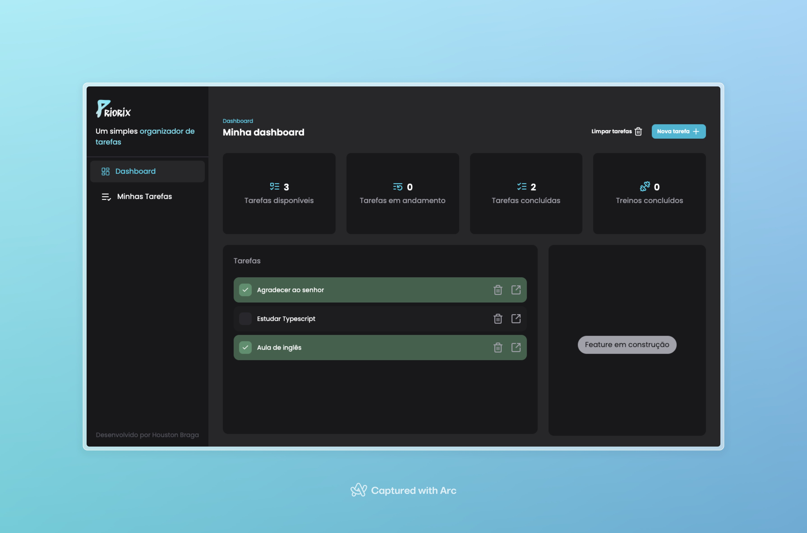

  

## Task Manager Priorix

Aplicação React para gerenciamento de tarefas com dashboard, lista de tarefas, detalhes de tarefa e (futuro) acompanhamento de treinos semanais. Front-end em Vite + Tailwind, dados em `json-server` e acesso via `axios` com React Query.

### Visão Geral

- **Dashboard**: cartões com métricas (tarefas disponíveis, em andamento, concluídas e treinos concluídos).
- **Tarefas**: listagem, criação, edição e exclusão; detalhes por página.
- **Sidebar/Header**: navegação e contexto visual do app.
- **Treinos (planejado)**: marcação por dia da semana e contagem agregada no dashboard.

### Stack e Principais Dependências

- **Build/Dev**: `Vite`
- **UI**: `React 18`, `TailwindCSS`, fontes Poppins
- **Dados**: `json-server` (arquivo `db.json`), `axios` (`src/lib/axios.js`)
- **Data fetching/state server**: `@tanstack/react-query`
- **Router**: `react-router-dom`
- **Ícones**: `lucide-react`
- **Form**: `react-hook-form`

### Estrutura de Pastas (resumo)

- `src/pages/`: páginas (`home.jsx`, `TasksPage.jsx`, `taskDetails.jsx`)
- `src/components/`: UI e widgets (ex.: `DashboardCardsList.jsx`, `ItemTask.jsx`, `WorkDay.jsx`)
- `src/hooks/data/`: hooks de dados com React Query (get/add/update/delete)
- `src/lib/axios.js`: client `axios` com `baseURL` para o `json-server`
- `src/sidebar/`: componentes da sidebar

### Scripts

- `npm run dev`: ambiente de desenvolvimento (Vite)
- `npm run build`: build de produção
- `npm run preview`: preview do build
- `npm run lint`: checagem de lint

### Como Rodar

1. Instale dependências: `npm install`
2. Inicie o JSON Server: `npx json-server --watch db.json --port 3000`
3. Inicie o front: `npm run dev`

`axios` está configurado em `src/lib/axios.js` com `baseURL` `http://localhost:3000`.

### Fluxo de Dados (Tarefas)

- Hooks em `src/hooks/data/` utilizam React Query para cache, sincronização e invalidação de queries.
- Chaves de queries/mutações em `src/keys/` para evitar colisões e padronizar.
- Operações CRUD batem no `json-server` via `axios`.

### Convenções de Estilo

- Tailwind para estilização utilitária.
- Componentes com props tipadas via `prop-types` quando aplicável.
- Nomes claros e sem abreviações, priorizando legibilidade.

### Otimizações e Boas Práticas

- **Cache de dados**: React Query já mitiga overfetching; use `staleTime` adequado nos hooks.
- **Invalidation seletiva**: invalide apenas as queries impactadas (ex.: ao adicionar tarefa, invalidate `tasks`).
- **Divs scrolláveis**: use `overflow-y-auto` e `max-h-[...]` para evitar layout shift em listas longas (aplicado na lista de tarefas em `home.jsx`).
- **Code-splitting**: considerar `React.lazy` para páginas menos acessadas (ex.: `taskDetails`).
- **Acessibilidade**: rotular inputs/botões e manter foco gerenciável em diálogos.

### Feature "Treinos" — Objetivo

A feature de Treinos permite que o usuário marque os dias da semana em que treinou e visualize, no dashboard, o total de treinos concluídos no período atual. Em resumo:

- **Marcação por dia**: interação com dias úteis (ex.: segunda a sexta) para marcar/desmarcar treinos realizados.
- **Contagem no dashboard**: o cartão "Treinos concluídos" reflete automaticamente o total de dias marcados.
- **Clareza visual**: estados marcados/desmarcados evidenciam rapidamente o progresso semanal.

### Endpoints (json-server)

- Tarefas: `GET/POST /tasks`, `PATCH/DELETE /tasks/:id`
- Treinos (sugerido): `GET /workouts`, `PATCH /workouts`

### Próximos Passos

- Implementar estado de treinos (Context API) e ligar ao cartão de dashboard.
- (Opcional) Persistir no `json-server` com hooks `useGetWorkouts`/`useUpdateWorkouts`.
- Adicionar testes de interação básica para `WorkDay` e contagem do dashboard.
